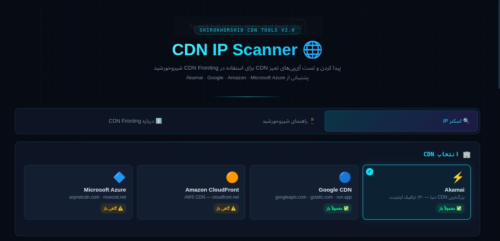
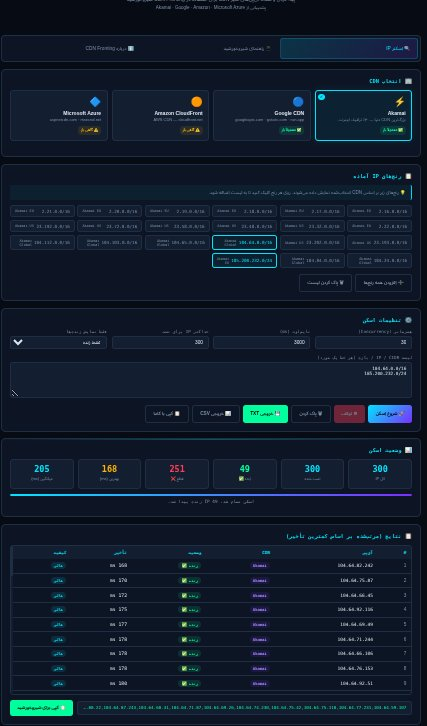
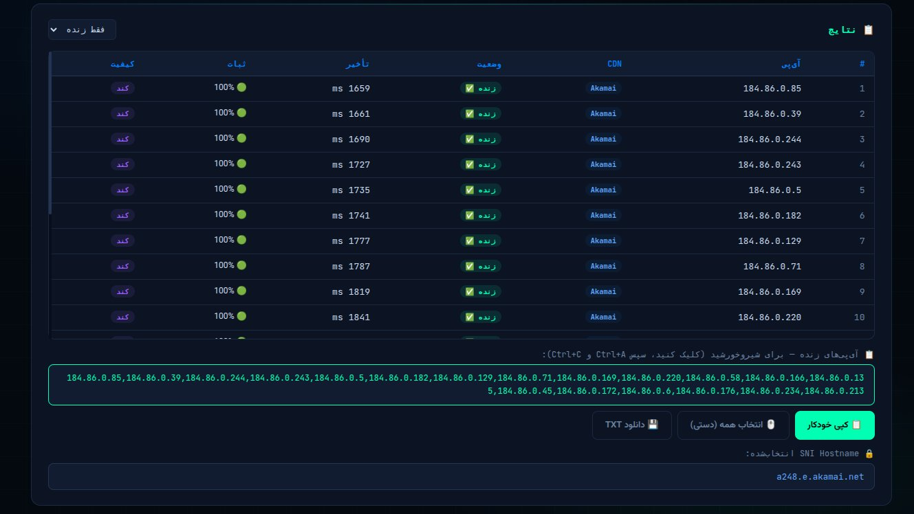
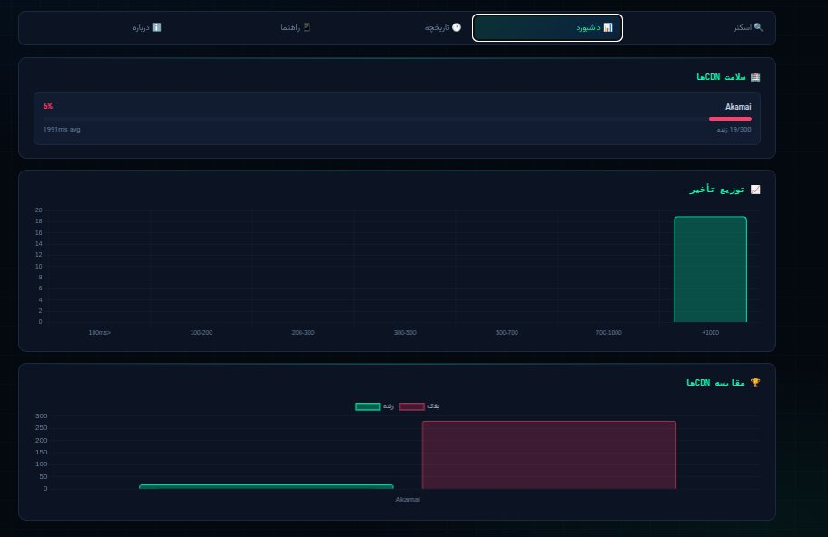
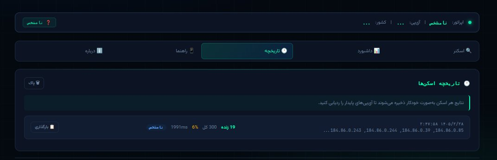

# 🌐 CDN IP Scanner for ShirOKhorshid

<div align="center">


**[English](#english) | [فارسی](#فارسی)**

</div>

---

## English

### What is This?

A set of tools to **find, test, and export CDN edge IPs** that are not blocked in Iran, for use in the **CDN Fronting** feature of [ShirOKhorshid](https://github.com/shirokhorshid/shirokhorshid-android) — a community fork of the Psiphon Android client.

Supports: **Akamai · Google CDN · Amazon CloudFront · Microsoft Azure CDN**

---

## 📸 Screenshots


*Header and CDN selector*


*Full scanner with IP ranges and settings*


*Results table with working IPs and copy bar*


*Dashboard — latency chart and CDN health bars*


*Scan history saved in browser*

---

## 🖥️ `index.html` — Web Scanner (Main Tool)

> The most important file in this project.
> **Open it directly in your browser inside Iran — no installation needed.**

`index.html` is a fully **serverless, single-file web application** that scans CDN IPs directly from your browser. Because the test runs inside your own browser, the results are **100% accurate for your specific ISP and network** — no proxy, no middleman.

### How to Use

**Option A — GitHub Pages (recommended):**
```
https://YOUR_USERNAME.github.io/cdn-ip-finder/
```
Open this URL inside Iran without VPN for accurate results.

**Option B — Local file:**
```bash
# Just download index.html and open it
open index.html       # Mac
xdg-open index.html   # Linux
# Or double-click the file on Windows
```

No server, no npm, no installation. Pure HTML + JS.

---

### `index.html` Features

| Feature | Description |
|---------|-------------|
| 🔍 **Direct browser scan** | Tests each IP with `fetch()` in `no-cors` mode — fast TCP check from your device |
| 🇮🇷 **ISP auto-detection** | Detects your operator (MCI / Irancell / Rightel / Shatel) via ipapi.co |
| ⭐ **ISP profile** | Shows pre-tested IPs known to work on your specific operator |
| ⚡ **Scan presets** | Quick (50 IPs) · Standard (250) · Deep (1000) · Recheck alive IPs |
| 🏢 **CDN selector** | Choose Akamai, Google, Amazon, Azure — or all at once |
| 🔒 **SNI selector** | Pick the right SNI hostname per CDN with one click |
| 📋 **Range chips** | Click IP ranges to add them — CIDR, range, or single IP supported |
| 📊 **Live dashboard** | Latency distribution chart + CDN health bars (loads Chart.js lazily) |
| 🕐 **Scan history** | Auto-saves last 20 scans to `localStorage` — no server needed |
| ⭐ **Stable IP detection** | Highlights IPs that appeared alive in multiple scans |
| 📋 **Copy for ShirOKhorshid** | One-click comma-separated output ready to paste |
| 📱 **QR code** | Instant transfer of working IPs to your phone |
| 💾 **Export** | Download results as TXT or CSV |
| ♻️ **Stability score** | Tests each IP multiple times to detect flaky connections |

---

### How the Browser Test Works

```
Iranian user opens index.html in browser
        ↓
Browser sends HEAD request to each CDN IP:
  fetch(`https://${ip}/`, { mode: 'no-cors' })
        ↓
Fast response (< 85% of timeout)
  → TCP connected → IP is REACHABLE on your ISP ✅
Slow / no response (≥ 85% of timeout)
  → Connection timed out → IP is BLOCKED on your ISP ❌
```

Even a TLS or CORS error counts as reachable — it means the IP responded.

---

### Tabs in `index.html`

| Tab | What It Does |
|-----|-------------|
| 🔍 **اسکنر** | Main scanner — CDN select, IP ranges, settings, results table |
| 📊 **داشبورد** | Latency chart + CDN health bars after scan |
| 🕐 **تاریخچه** | Scan history from localStorage + stable IP suggestions |
| 📱 **راهنما** | Step-by-step guide for using results in ShirOKhorshid |
| ℹ️ **درباره** | Explanation of how CDN Fronting works |

---

### SNI Hostnames Available in `index.html`

| CDN | SNI Options |
|-----|------------|
| ⚡ Akamai | `a248.e.akamai.net` · `a77.net.akamai.net` · `ds-aksb.akamaized.net` |
| 🔵 Google | `fonts.googleapis.com` · `ajax.googleapis.com` · `storage.googleapis.com` |
| 🟠 Amazon | `d1.cloudfront.net` · `d2.cloudfront.net` · `aws.cloudfront.net` |
| 🔷 Azure | `ajax.aspnetcdn.com` · `az416426.vo.msecnd.net` · `cdn.office.net` |

---

### IP Ranges Included in `index.html`

| CDN | Ranges | Coverage |
|-----|--------|----------|
| Akamai | 26 ranges (/24) | EU, US, Global |
| Google | 12 ranges (/24) | Cloud Run, Core |
| Amazon | 10 ranges (/24) | US, Global |
| Azure | 7 ranges (/24) | US, Global |

---

### Technical Details

- **No external dependencies** at load time — Chart.js loads lazily only when Dashboard tab is opened
- **QR code** generated via `api.qrserver.com` (free, no API key)
- **History** stored in browser `localStorage` — private, never sent anywhere
- **ISP detection** via `ipapi.co/json/` — only used to show your operator name
- Works as a **static file** — can be served from GitHub Pages, any web host, or opened locally

---

## 🖥️ Bash Scripts (Server-side Testing)

For testing via real Iranian network nodes, run these on a Linux server **outside Iran**.

#### `scripts/akamai_finder.sh` — Quick Akamai IP Finder

Resolves 20+ major Akamai-hosted domains and tests IPs from your machine.

```bash
chmod +x scripts/akamai_finder.sh
./scripts/akamai_finder.sh
```

- ✅ Fast (~2 minutes)
- ✅ Good for a quick initial list
- ❌ Tests from your machine, not from inside Iran

---

#### `scripts/akamai_iran_checker.sh` — Akamai Iran Tester

Tests Akamai IPs from real Iranian nodes via check-host.net API.

```bash
chmod +x scripts/akamai_iran_checker.sh
./scripts/akamai_iran_checker.sh
```

- ✅ Uses ir1, ir2, ir3, ir4 Iranian nodes (Tehran, Isfahan, Mashhad)
- ✅ More accurate for Iran
- ❌ Slower (~10–15 min)

---

#### `scripts/cdn_iran_checker.sh` — Full CDN Iran Checker ⭐

Tests all CDNs from Iranian nodes. Most comprehensive tool.

```bash
chmod +x scripts/cdn_iran_checker.sh
./scripts/cdn_iran_checker.sh
```

- ✅ Tests Akamai, Google, Amazon, Azure
- ✅ First checks which CDNs are accessible in Iran
- ✅ Tests each IP from 4 Iranian nodes
- ✅ Outputs comma-separated list ready for ShirOKhorshid
- ❌ Takes 15–30 minutes

---

## How to Use Results in ShirOKhorshid

1. Run the web scanner (`index.html`) or a bash script
2. Copy the comma-separated IP list
3. Open **ShirOKhorshid** → Settings → CDN Fronting
4. Tap **CDN edge IPs** → paste the list
5. Tap **CDN SNI hostname** → enter one of:

```
Akamai  →  a248.e.akamai.net
Google  →  fonts.googleapis.com
Amazon  →  d1.cloudfront.net
Azure   →  ajax.aspnetcdn.com
```

6. Set **Connection Protocol** → **CDN Fronting** → Connect! 🎉

---

## How CDN Fronting Works

```
[User in Iran]
      ↓  connects to CDN IP (not blocked)
[CDN Edge IP]  ← firewall sees safe SNI, allows it
      ↓  CDN forwards traffic internally (Host header is encrypted)
[Psiphon Server]
      ↓
[Free Internet 🌍]
```

Iran's firewall cannot block Akamai or Google without also breaking
thousands of Iranian banking, news, and government websites.

---

## Project Structure

```
cdn-ip-finder/
├── index.html                    # ⭐ Web scanner — open in browser
├── scripts/
│   ├── akamai_finder.sh          # Quick Akamai IP finder
│   ├── akamai_iran_checker.sh    # Akamai tester via Iranian nodes
│   └── cdn_iran_checker.sh       # Full CDN checker ⭐
├── docs/
│   └── how-it-works.md           # Technical explanation
├── results/
│   └── .gitkeep                  # Save your results here
├── README.md
└── LICENSE
```

---

## Requirements

**For `index.html`:** just a browser — no installation needed.

**For bash scripts:**
```bash
# Ubuntu / Debian
sudo apt install curl dnsutils python3 -y

# CentOS / RHEL
sudo yum install curl bind-utils python3 -y
```

---

## Contributing

If you have tested IPs from inside Iran, open an Issue and share:

- Which **ISP** (MCI / Irancell / Rightel / Shatel / other)
- Which **IPs** worked
- **Date** of testing (IPs rotate frequently!)
- Your **city** (filtering can differ by region)

---

## Related Projects

- [ShirOKhorshid Android](https://github.com/shirokhorshid/shirokhorshid-android)
- [Psiphon](https://psiphon.ca)

---

## License

GPL-3.0 — same as ShirOKhorshid and Psiphon

---
---

## فارسی

### این پروژه چیست؟

مجموعه‌ای از ابزارها برای **پیدا کردن، تست و خروجی گرفتن از آی‌پی‌های CDN** که در ایران فیلتر نشده‌اند، جهت استفاده در قابلیت **CDN Fronting** اپلیکیشن [شیروخورشید](https://github.com/shirokhorshid/shirokhorshid-android).

پشتیبانی از: **Akamai · Google CDN · Amazon CloudFront · Microsoft Azure CDN**

---

## 📸 تصاویر


*هدر و انتخاب CDN*


*اسکنر کامل با رنج‌های IP و تنظیمات*


*جدول نتایج با آی‌پی‌های زنده و کپی بار*


*داشبورد — نمودار تأخیر و سلامت CDN*


*تاریخچه اسکن‌ها در مرورگر*

---

## 🖥️ فایل `index.html` — اسکنر وب (ابزار اصلی)

> مهم‌ترین فایل این پروژه.
> **مستقیماً در مرورگر خود داخل ایران باز کنید — نیازی به نصب ندارد.**

`index.html` یک **وب‌اپلیکیشن تک‌فایلی و بدون سرور** است که آی‌پی‌های CDN را مستقیماً از مرورگر شما اسکن می‌کند. چون تست داخل مرورگر خود شما اجرا می‌شود، نتایج **دقیقاً بر اساس اپراتور و شبکه شما** است — بدون پروکسی، بدون واسطه.

### نحوه استفاده

**روش الف — GitHub Pages (توصیه‌شده):**
```
https://YOUR_USERNAME.github.io/cdn-ip-finder/
```
این لینک را از داخل ایران و بدون VPN باز کنید تا نتایج دقیق باشد.

**روش ب — فایل محلی:**
```bash
# فقط index.html را دانلود کنید و باز کنید
open index.html       # Mac
xdg-open index.html   # Linux
# یا روی ویندوز دابل‌کلیک کنید
```

بدون سرور، بدون npm، بدون نصب. فقط HTML + JS خالص.

---

### امکانات `index.html`

| امکان | توضیح |
|-------|-------|
| 🔍 **اسکن مستقیم از مرورگر** | هر آی‌پی را با `fetch()` در حالت `no-cors` تست می‌کند |
| 🇮🇷 **شناسایی اپراتور** | اپراتور شما را تشخیص می‌دهد (همراه اول / ایرانسل / رایتل / شاتل) |
| ⭐ **پروفایل اپراتور** | آی‌پی‌های تأییدشده برای اپراتور شما را نشان می‌دهد |
| ⚡ **پریست‌های اسکن** | سریع (۵۰) · استاندارد (۲۵۰) · عمیق (۱۰۰۰) · بررسی مجدد |
| 🏢 **انتخاب CDN** | Akamai، Google، Amazon، Azure — یا همه با هم |
| 🔒 **انتخاب SNI** | انتخاب SNI Hostname مناسب با یک کلیک |
| 📋 **چیپ‌های رنج IP** | کلیک روی رنج‌ها برای افزودن — CIDR، بازه یا IP تکی |
| 📊 **داشبورد زنده** | نمودار تأخیر + نوارهای سلامت CDN |
| 🕐 **تاریخچه اسکن** | ذخیره خودکار ۲۰ اسکن آخر در `localStorage` |
| ⭐ **تشخیص آی‌پی پایدار** | آی‌پی‌هایی که در چندین اسکن زنده بودند را برجسته می‌کند |
| 📋 **کپی برای شیروخورشید** | خروجی comma-separated آماده paste |
| 📱 **QR کد** | انتقال فوری آی‌پی‌های زنده به گوشی |
| 💾 **خروجی** | دانلود نتایج به فرمت TXT یا CSV |
| ♻️ **امتیاز ثبات** | هر آی‌پی را چندین بار تست می‌کند تا اتصالات ناپایدار شناسایی شوند |

---

### تب‌های `index.html`

| تب | کارکرد |
|----|--------|
| 🔍 **اسکنر** | اسکنر اصلی — انتخاب CDN، رنج‌های IP، تنظیمات، جدول نتایج |
| 📊 **داشبورد** | نمودار تأخیر + نوارهای سلامت CDN بعد از اسکن |
| 🕐 **تاریخچه** | تاریخچه اسکن‌ها + پیشنهاد آی‌پی‌های پایدار |
| 📱 **راهنما** | راهنمای گام‌به‌گام استفاده از نتایج در شیروخورشید |
| ℹ️ **درباره** | توضیح نحوه کار CDN Fronting |

---

### SNI Hostname‌های موجود در `index.html`

| CDN | گزینه‌های SNI |
|-----|--------------|
| ⚡ Akamai | `a248.e.akamai.net` · `a77.net.akamai.net` · `ds-aksb.akamaized.net` |
| 🔵 Google | `fonts.googleapis.com` · `ajax.googleapis.com` · `storage.googleapis.com` |
| 🟠 Amazon | `d1.cloudfront.net` · `d2.cloudfront.net` · `aws.cloudfront.net` |
| 🔷 Azure | `ajax.aspnetcdn.com` · `az416426.vo.msecnd.net` · `cdn.office.net` |

---

## اسکریپت‌های Bash (تست سمت سرور)

برای تست دقیق‌تر از طریق نودهای ایرانی، این اسکریپت‌ها را روی یک سرور لینوکس **خارج از ایران** اجرا کنید.

#### `scripts/akamai_finder.sh` — جستجوگر سریع Akamai

```bash
chmod +x scripts/akamai_finder.sh
./scripts/akamai_finder.sh
```

#### `scripts/akamai_iran_checker.sh` — تستر ایرانی Akamai

```bash
chmod +x scripts/akamai_iran_checker.sh
./scripts/akamai_iran_checker.sh
```

#### `scripts/cdn_iran_checker.sh` — چکر کامل CDN ⭐

```bash
chmod +x scripts/cdn_iran_checker.sh
./scripts/cdn_iran_checker.sh
```

---

## نحوه استفاده از نتایج در شیروخورشید

۱. اسکنر وب یا اسکریپت bash را اجرا کنید
۲. لیست آی‌پی‌های comma-separated را کپی کنید
۳. شیروخورشید → تنظیمات → CDN Fronting
۴. روی **CDN edge IPs** بزنید → لیست را paste کنید
۵. روی **CDN SNI hostname** بزنید:

```
Akamai  →  a248.e.akamai.net
Google  →  fonts.googleapis.com
Amazon  →  d1.cloudfront.net
Azure   →  ajax.aspnetcdn.com
```

۶. Connection Protocol → **CDN Fronting** → وصل شوید! 🎉

---

## ساختار پروژه

```
cdn-ip-finder/
├── index.html                    # ⭐ اسکنر وب — در مرورگر باز کنید
├── scripts/
│   ├── akamai_finder.sh          # جستجوگر سریع Akamai
│   ├── akamai_iran_checker.sh    # تستر از نودهای ایرانی
│   └── cdn_iran_checker.sh       # چکر کامل CDN ⭐
├── docs/
│   └── how-it-works.md           # توضیح فنی
├── results/
│   └── .gitkeep
├── README.md
└── LICENSE
```

---

## مشارکت

اگر از داخل ایران آی‌پی‌ها را تست کرده‌اید، یک Issue باز کنید:

- کدام **اپراتور** (همراه اول / ایرانسل / رایتل / شاتل / دیگران)
- کدام **آی‌پی‌ها** کار کردند
- **تاریخ** تست
- **شهر** شما

---

## پروژه‌های مرتبط

- [شیروخورشید اندروید](https://github.com/shirokhorshid/shirokhorshid-android)
- [سایفون](https://psiphon.ca)

---

## لایسنس

GPL-3.0 — مثل شیروخورشید و سایفون
